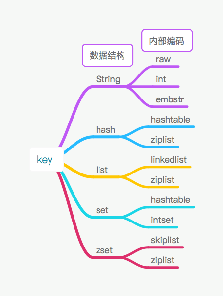

## 全局命令
+ 查看所有的键
`keys *`

+ 键总数
`dbsize`

+ 检查键是否存在
`exists key` 存在:1, 不存在:0

+ 删除键
`del key [key ...]`

+ 设置key过期时间
`expire key seconds` 

+ 键的数据结构
`type key`  键不存在时返回 none

## 数据结构和内部编码

redis 一共五种数据类型,每种数据类型都对应有自己的底层内部编码实现,使用 `object encoding` 命令查询内部编码.



## 单线程架构

reids服务端采用单线程和I/O多路复用模型实现. 当客户端有多个命令过来时,redis不会立即执行,而是将其放入一个队列中,然后被逐个执行, 采用单线程结构能避免并发产生的问题. 

**redis采用单线还很快的原因:**

1. 纯内存访问. redis将所有的数据都放到内存中, 内存的响应速度非常快.

2. 使用非阻塞I/O.  redis使用epoll作为I/O多路复用技术的实现,redis将epoll中的连接,读写,关闭都转换为事件,不用在网络I/O中浪费时间. 

3. 单线程避免了线程切换产生的消耗 

**单线程的好处:**

+ 单线程环境下可以简化数据结构和算法的实现.

+ 单线程避免了线程切换,和竞争锁的消耗. 

单线的问题: 使用单线程如果某个命令执行时间过长 会造成其他命令的阻塞. 

## 字符串

### 常用命令

1. 设置值

   `set key value [ex seconds] [px milliseconds] [nx|xx]` 

set命令选项:

- ex seconds 秒级过期时间
- px milliseconds 毫秒级过期时间
- xx 键必须并**不存在**才能设置成功
- nx 与xx相反, 键必须**存在**才能设置成功, 用于更新

除了`set`还有`setnx`和`setxx`两个命令, 它们和 加参数nx和xx效果相同. 

2. 获取值 

   获取值使用`get`命令, 如果获取的值不存在时,返回`nil`

3. 批量设置值

   使用`mset`命令可以批量设置值. 例如: `mset a 1 b 2 c 3 d 4` 一次性设置4个键

4. 批量获取值 

   使用`mget`命令批量获取值. 例如 : `mget a b c d` 

5. 计数

   命令: `incr key` 

   使用incr对值进行操作的三种结果:

   - 值不是整数. 返回错误

   - 值是整数 返回自增后的数值

   - 键不存在时, 按照0自增,返回1,并添加

除了incr命令，Redis提供了decr（自减）、incrby（自增指定数字）、 decrby（自减指定数字）、incrbyfloat（自增浮点数）

**不常用的命令:**

- `append` 向字符串尾部追加值

- `strlen` 返回字符串长度

- `getset` 设置并返回值

- `setrange key offeset value`设置指定字符串

- `getrange key star end` 获取部分字符串

字符串类型命令的时间复杂度:


### 内部编码
字符串内部有3种编码:

- int  8个字节长度的长整型 
- emstr  小于等于39个字节的字符串
- raw	大于39个字节的字符串
redis会根据数据的类型和长度自动决定使用哪种编码方式实现. 

### 使用场景

- 缓存数据 作为数据库和业务数据之间的缓存 
- 计数 使用redis的incr可以作为业务的计数工具
- session共享. 将一个分布式web服务中的用户的session信息保存在redis中

## 哈希(hash)

在redis中哈希类型是键值对结构. 

### 命令 
1. 设置值
`hset key field value ` 
设置成功如果是新属性,返回1, 否则返回0. redis 提供了 `hsetnx`命令, 它和`setnx`命令功能一样, 但是**作用域为filed**

2. 获取值 
`hget key field` 
如果键或者field 不存在时返回 nil

3. 删除field
`hdel key field [field ...]` 
删除一个或者多个field, 返回删除个数

4. 计算field个数
`hlen key`

5. 批量设置或者获取 field-value
`hmget key field [field ...]`
`hmset key field value [field value ...]`

6. 判断field是否存在
`hexists key field` 
存在返回1, 否则返回0 

7. 获取所有的field
`hkeys key`

8. 获取所以的value 
`hvals key` 

9. 获取所有的field-value
`hgetall key`

10. 自增
`hincrby key field` 
`hincrbyfloat key field` 
对field进行自增

11. value的长度 
`hstrlen key field` 

### 内部编码

+ ziplist
  - 元素个数小于`hash-max-ziplist-entries` (默认512)
  - 所有的value都小于`hash-max-ziplist-value`(默认64)
+ hashtable 
当元素不满足ziplist要求的条件时 会使用hashtable作为hash的内部实现

### 使用场景
缓存结构化数据

## 列表(list)

redis列表: 
- 有序(插入的顺序)
- 最多2^32 - 1个元素
- 可以包含重复元素

### 命令

1. 添加操作

    - 从右边插入元素
    `rpush key value [value ...]`

    - 从左往右插入元素 
    `lpush key value [value ...]`

    - 向某个元素前或者后插入元素 
    `linsert key before|after pivot value`
    linsetr 命令会在列表中找到 pivot元素 在其前面后置后面插入元素value 

2. 查找

    - 查找指定范围内的元素列表
      `lrange key start end` 
      lrange操作会获取列表指定索引范围内所有的元素. 
      - 索引下标从左到右为0到N-1, 从右往左为 -1 到 -N
      - lrang的end索引包含自身 

    - 查找指定索引的元素
    `lindex key index`

    - 获取列表的长度 
    `llen key` 

3. 删除 

    - 从列表左边弹出元素 

      `lpop key`   返回被弹出的元素

    - 从列表右侧弹出
      `rpop key` 

    - 删除指定元素 
      `lerm key count value` 
      从列表中找到等于value的元素删除 ,返回删除的个数
      - count > 0 从左到右 删除最多count个元素 
      - count < 0 从右到左 删除最多count个元素
      - count = 0 删除所有元素
      
     - 按照索引范围裁剪 
    	 	`ltrim key start end`

 4. 修改 
     `lset key index newValue`

 5. 阻塞模式 
     `blpop key [key ...] timeout` 
      	key[key ...] 多个列表的键 
      	timeout  阻塞时间(单位秒 )
        执行命令后客户端阻塞,直到list中有元素,然后弹出. 如果超过设置的timeout时间,返回nil
        如果多个客户端执行blpop 最先执行的客户端先弹出


### 内部编码

- ziplist

  - 元素个数小于``list-max-ziplist-entries` (默认512)
  - 所有的value都小于`list-max-ziplist-value`(默认64)

- linkedlist
  当元素不满足ziplist要求的条件时 会使用linkedlist作为list的内部实现

### 使用场景

1. 消息队列 

   使用 lpush+brpop 组合命令可以实现阻塞队列.生产者使用客户端进行lrpush, 多个消费者客户端使用brpop 命令消费 队列尾部元素.

2. 使用索引进行分页操作

## 集合 

集合(set)类型用来保存多个字符元素 

- 集合中不允许有重复元素
- 集合中元素是无序的,不能通过索引值获取然后 

### 命令

1. 添加元素

   `sadd key element[element ...]` 

   返回添加成功的个数

2. 删除元素 

   `srem key element[element ...]` 

   返回成功删除元素的个数

3. 计算元素的个数

   `scard key`

4. 判断元素是否在集合中

   `sismeber key element `

   在集合内返回1.否则返回0

5. 随机从集合中返回指定个数元素

   `srandmember key count` 

6. 从集合中随机弹出元素

   `spop key`

7. 获取所有元素

   `smembers key`

**集合之间的命令:**

1. 求多个集合的交集

   `siner key [key ...]`

2. 求多个集合的并集

   `suion key [key ...]`

3. 求多个集合的差集 

   `sdiff key[key ...]`

4. 将交集、并集、差集的结果保存

   ```
   sinterstore destination key [key ...] 
   suionstore destination key  [key ...] 
   sdiffstore destination key  [key ...]
   ```

### 内部编码

+ intset  

+ hashtable

### 使用场景
标签

## 有序集合

- 不能重复
- 元素可以排序(按照元素的score排序)

### 命令 

1. 添加元素

   `zadd add key score ,member[score member]`

   zadd的四个选项:

   + nx member 必须不存在,才能设置成功
   + xx member 必须存在才能设置成功 
   + ch 返回此次操作后, 有序集合元素和分数发生变化的个数
   + incr 对分数(score)增加

2. 获取元素的个数

   `zcard key` 

3. 获取某个成员的分数

   `zscore key member` 

   如果成员不存在时,返回nil

4. 获取成员通过排名(排名从0开始)

   `zrank key member`

   分数从低到高返回排名

   `zrevrank key member`

   分数从高到低,返回排名

5. 删除成员

   `zrem key member`

   返回删除结果为成功删除的个数

6. 增加成员分数

   `zincrby key increment member`

7. 返回指定排名范围的成员

   `zrange key start end [withscore]`

   从低到高返回

       `zrevrange key start end[withscore]`
        
       从高到第返回

8. 返回指定分数范围的成员

   `zrangbyscore key mim max [withscore] [limit offset count]`

   按照分数从低到高返回

   `zrevrangebyscore key mim max [withscore][limit offset count]`

   按照分数从高到第返回

   min和max还支持开区间（小括号）和闭区间（中括号），-inf和 +inf分别代表无限小和无限大

9. 获取指定分数范围成员个数

   `zcount key min max` 

10. 删除指定排名内的元素

    `zremrangerank key start end `

11. 删除指定分数范围的成员

    `zremrangebyscore key min max`
### 内部编码
- ziplist 
	- 当有序集合的元素个数小于zset-max-ziplist-entries配置（默认128个）
	- 每个元素的值都小于zset-max-ziplist-value配 置（默认64字节）

- skipelist 
当ziplist条件不满足时，有序集合会使用skiplist作 为内部实现. 

### 使用场景
排名系统 


## 键的管理

### 单个键管理

1. 重命名

   `rename key newkey` 

   如果新的键名已存在将被覆盖. 使用 renamenx 可以保证不覆盖原来的键

   成功返回OK, 否则返回 0. 

   需要注意的问题:

   + 重命名会执行删除操作, 如果键对应的值较大,可能会造成阻塞. 

2. 随机返回一个键

   `randomkey `

3. 给键设置过期,

   `expire key seconds` 键在seconds 后过期

   `expireat key timestamp` 键在时间戳后过期

   `ttl|pttl key` 返回剩余时间 ttl返回秒, pttl返回毫秒

   设置过期注意问题:

   + 如果expire key 的key不存在返回0 
   + 如果设置过期的时间为负值, 键会被立即删除
   + persist命令可以将键的过期时间清除
   + 对于字符串 set 命令会将原来的过期时间去掉
   + redis 不支持二级内部元素过期 
   + setex 命令 等于 set + expire的组合, 非原子性

4. 迁移键

   + `move key db`

     用于redis实例内部的数据迁移

   + `dump + restore `

     用于不同redis实例之间的数据迁移,迁移步骤:

     + 在源Redis上执行dump命令,将键值采用RDB格式序列化 
     + 在目标Redis上执行 restore命令,将上面序列化的值进行复原 

   + migrate  

     用于Redis实例之间的数据迁移

     **migrate的特点:**

     1. 执行过程是原子性
     2. 传输数据之间在源Redis和目标Redis上产生
     3. 目标Redis完成restore 后会发送OK给源Redis，源Redis接收后会根据migrate对应的选项来决定是否 在源Redis上删除对应的键。


