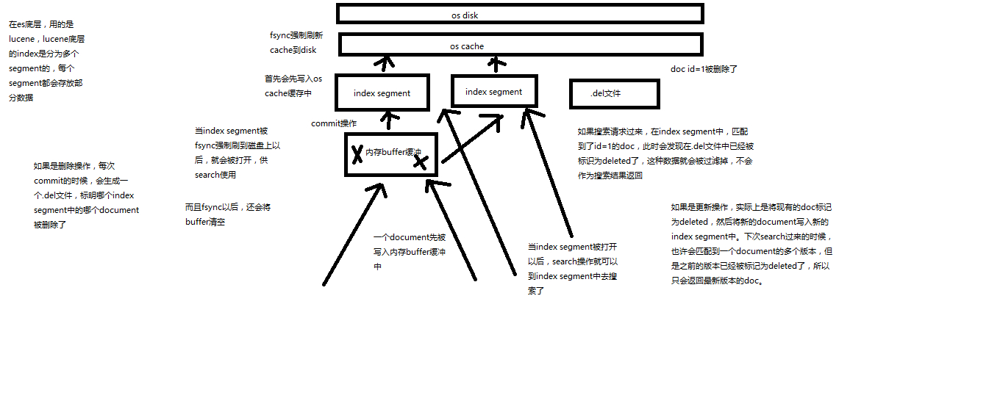
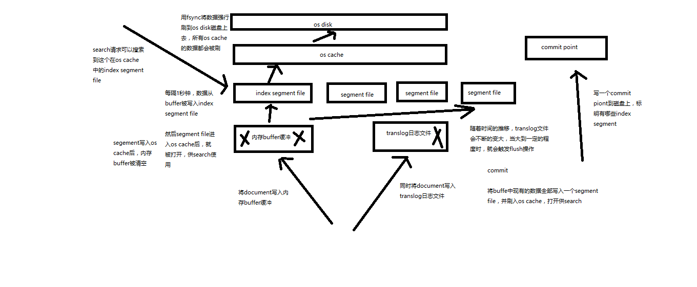

## 查询

1、query string search
2、query DSL
3、query filter
4、full-text search
5、phrase search
6、highlight search

---------------------------------------------------------------------------------------------------------------------------------


### 1、query string search

搜索全部商品：GET /ecommerce/product/_search


+ took：耗费了几毫秒
+ timed_out：是否超时，这里是没有
+ _shards：数据拆成了5个分片，所以对于搜索请求，会打到所有的primary shard（或者是它的某个replica shard也可以）
+ hits.total：查询结果的数量，3个document
+ hits.max_score：score的含义，就是document对于一个search的相关度的匹配分数，越相关，就越匹配，分数也高
+ hits.hits：包含了匹配搜索的document的详细数据

``` 
{
  "took": 2,
  "timed_out": false,
  "_shards": {
    "total": 5,
    "successful": 5,
    "failed": 0
  },
  "hits": {
    "total": 3,
    "max_score": 1,
    "hits": [
      {
        "_index": "ecommerce",
        "_type": "product",
        "_id": "2",
        "_score": 1,
        "_source": {
          "name": "jiajieshi yagao",
          "desc": "youxiao fangzhu",
          "price": 25,
          "producer": "jiajieshi producer",
          "tags": [
            "fangzhu"
          ]
        }
      },
      {
        "_index": "ecommerce",
        "_type": "product",
        "_id": "1",
        "_score": 1,
        "_source": {
          "name": "gaolujie yagao",
          "desc": "gaoxiao meibai",
          "price": 30,
          "producer": "gaolujie producer",
          "tags": [
            "meibai",
            "fangzhu"
          ]
        }
      },
      {
        "_index": "ecommerce",
        "_type": "product",
        "_id": "3",
        "_score": 1,
        "_source": {
          "name": "zhonghua yagao",
          "desc": "caoben zhiwu",
          "price": 40,
          "producer": "zhonghua producer",
          "tags": [
            "qingxin"
          ]
        }
      }
    ]
  }
}
```

query string search的由来，因为search参数都是以http请求的query string来附带的

搜索商品名称中包含yagao的商品，而且按照售价降序排序：GET /ecommerce/product/_search?q=name:yagao&sort=price:desc

适用于临时的在命令行使用一些工具，比如curl，快速的发出请求，来检索想要的信息；但是如果查询请求很复杂，是很难去构建的
在生产环境中，几乎很少使用query string search

---------------------------------------------------------------------------------------------------------------------------------

### 2、query DSL

>  DSL：Domain Specified Language，特定领域的语言
> http request body：请求体，可以用json的格式来构建查询语法，比较方便，可以构建各种复杂的语法，比query string search肯定强大多了

查询所有的商品

```
GET /ecommerce/product/_search
{
  "query": { "match_all": {} }
}
```

查询名称包含yagao的商品，同时按照价格降序排序

``` 
GET /ecommerce/product/_search
{
    "query" : {
        "match" : {
            "name" : "yagao"
        }
    },
    "sort": [
        { "price": "desc" }
    ]
}
```

分页查询商品，总共3条商品，假设每页就显示1条商品，现在显示第2页，所以就查出来第2个商品

``` 
GET /ecommerce/product/_search
{
  "query": { "match_all": {} },
  "from": 1,
  "size": 1
}
```

指定要查询出来商品的名称和价格就可以

```
 GET /ecommerce/product/_search
{
  "query": { "match_all": {} },
  "_source": ["name", "price"]
}
```

更加适合生产环境的使用，可以构建复杂的查询

 #### 1 基本实例

 GET /_search
{
​     "query": {
​         "match_all": {}
​     }
}

#### 2、Query DSL的基本语法

```
{
    QUERY_NAME: {
        ARGUMENT: VALUE,
        ARGUMENT: VALUE,...
    }
}

{
    QUERY_NAME: {
        FIELD_NAME: {
            ARGUMENT: VALUE,
            ARGUMENT: VALUE,...
        }
    }
}
```


示例：

```
GET /test_index/test_type/_search 
{
  "query": {
    "match": {
      "test_field": "test"
    }
  }
}
```


#### 3、如何组合多个搜索条件

搜索需求：title必须包含elasticsearch，content可以包含elasticsearch也可以不包含，author_id必须不为111

``` 
{
  "took": 1,
  "timed_out": false,
  "_shards": {
     "total": 5,
     "successful": 5,
     "failed": 0
  },
  "hits": {
     "total": 3,
     "max_score": 1,
     "hits": [
       {
         "_index": "website",
         "_type": "article",
         "_id": "2",
         "_score": 1,
         "_source": {
           "title": "my hadoop article",
           "content": "hadoop is very bad",
           "author_id": 111
         }
       },
       {
         "_index": "website",
         "_type": "article",
         "_id": "1",
         "_score": 1,
         "_source": {
           "title": "my elasticsearch article",
           "content": "es is very bad",
           "author_id": 110
         }
       },
       {
         "_index": "website",
         "_type": "article",
         "_id": "3",
         "_score": 1,
         "_source": {
           "title": "my elasticsearch article",
           "content": "es is very goods",
           "author_id": 111
         }
       }
     ]
  }
}

GET /website/article/_search
{
  "query": {
     "bool": {
       "must": [
         {
           "match": {
             "title": "elasticsearch"
           }
         }
       ],
       "should": [
         {
           "match": {
             "content": "elasticsearch"
           }
         }
       ],
       "must_not": [
         {
           "match": {
             "author_id": 111
           }
         }
       ]
     }
  }
}

GET /test_index/_search
{
     "query": {
             "bool": {
                 "must": { "match":   { "name": "tom" }},
                 "should": [
                     { "match":       { "hired": true }},
                     { "bool": {
                         "must":      { "match": { "personality": "good" }},
                         "must_not":  { "match": { "rude": true }}
                     }}
                 ],
                 "minimum_should_match": 1
             }
     }
}

```


---------------------------------------------------------------------------------------------------------------------------------

### 3、query filter

搜索商品名称包含yagao，而且售价大于25元的商品
```
GET /ecommerce/product/_search
{
    "query" : {
        "bool" : {
            "must" : {
                "match" : {
                    "name" : "yagao" 
                }
            },
            "filter" : {
                "range" : {
                    "price" : { "gt" : 25 } 
                }
            }
        }
    }
}
```
---------------------------------------------------------------------------------------------------------------------------------

### 4、full-text search（全文检索）

```
GET /ecommerce/product/_search
{
    "query" : {
        "match" : {
            "producer" : "yagao producer"
        }
    }
}
```

producer这个字段，会先被拆解，建立倒排索引

special		4
yagao		4
producer	1,2,3,4
gaolujie	1
zhognhua	3
jiajieshi	2

yagao producer ---> yagao和producer
```
{
  "took": 4,
  "timed_out": false,
  "_shards": {
     "total": 5,
     "successful": 5,
     "failed": 0
  },
  "hits": {
     "total": 4,
     "max_score": 0.70293105,
     "hits": [
       {
         "_index": "ecommerce",
         "_type": "product",
         "_id": "4",
         "_score": 0.70293105,
         "_source": {
           "name": "special yagao",
           "desc": "special meibai",
           "price": 50,
           "producer": "special yagao producer",
           "tags": [
             "meibai"
           ]
         }
       },
       {
         "_index": "ecommerce",
         "_type": "product",
         "_id": "1",
         "_score": 0.25811607,
         "_source": {
           "name": "gaolujie yagao",
           "desc": "gaoxiao meibai",
           "price": 30,
           "producer": "gaolujie producer",
           "tags": [
             "meibai",
             "fangzhu"
           ]
         }
       },
       {
         "_index": "ecommerce",
         "_type": "product",
         "_id": "3",
         "_score": 0.25811607,
         "_source": {
           "name": "zhonghua yagao",
           "desc": "caoben zhiwu",
           "price": 40,
           "producer": "zhonghua producer",
           "tags": [
             "qingxin"
           ]
         }
       },
       {
         "_index": "ecommerce",
         "_type": "product",
         "_id": "2",
         "_score": 0.1805489,
         "_source": {
           "name": "jiajieshi yagao",
           "desc": "youxiao fangzhu",
           "price": 25,
           "producer": "jiajieshi producer",
           "tags": [
             "fangzhu"
           ]
         }
       }
     ]
  }
}
```
---------------------------------------------------------------------------------------------------------------------------------

### 5、phrase search（短语搜索）

跟全文检索相对应，相反，全文检索会将输入的搜索串拆解开来，去倒排索引里面去一一匹配，只要能匹配上任意一个拆解后的单词，就可以作为结果返回
phrase search，要求输入的搜索串，必须在指定的字段文本中，完全包含一模一样的，才可以算匹配，才能作为结果返回
```
GET /ecommerce/product/_search
{
    "query" : {
        "match_phrase" : {
            "producer" : "yagao producer"
        }
    }
}

{
  "took": 11,
  "timed_out": false,
  "_shards": {
    "total": 5,
    "successful": 5,
    "failed": 0
  },
  "hits": {
     "total": 1,
     "max_score": 0.70293105,
     "hits": [
       {
         "_index": "ecommerce",
         "_type": "product",
         "_id": "4",
         "_score": 0.70293105,
         "_source": {
           "name": "special yagao",
           "desc": "special meibai",
           "price": 50,
           "producer": "special yagao producer",
           "tags": [
             "meibai"
           ]
         }
       }
     ]
  }
}
```
---------------------------------------------------------------------------------------------------------------------------------

### 6、highlight search（高亮搜索结果）
``` 
GET /ecommerce/product/_search
{
     "query" : {
         "match" : {
             "producer" : "producer"
         }
     },
     "highlight": {
         "fields" : {
             "producer" : {}
         }
     }
}
```

## 聚合索引

### 第一个分析需求：计算每个tag下的商品数量

```
GET /ecommerce/product/_search
{
  "aggs": {
    "group_by_tags": {
      "terms": { "field": "tags" }
    }
  }
}
```
将文本field的fielddata属性设置为true
``` 
PUT /ecommerce/_mapping/product
{
  "properties": {
     "tags": {
       "type": "text",
       "fielddata": true
     }
  }
}
```
```
GET /ecommerce/product/_search
{
  "size": 0,
  "aggs": {
     "all_tags": {
       "terms": { "field": "tags" }
     }
  }
}
```
```
{
  "took": 20,
  "timed_out": false,
  "_shards": {
     "total": 5,
     "successful": 5,
     "failed": 0
  },
  "hits": {
     "total": 4,
     "max_score": 0,
     "hits": []
  },
  "aggregations": {
     "group_by_tags": {
       "doc_count_error_upper_bound": 0,
       "sum_other_doc_count": 0,
       "buckets": [
         {
           "key": "fangzhu",
           "doc_count": 2
         },
         {
           "key": "meibai",
           "doc_count": 2
         },
         {
           "key": "qingxin",
           "doc_count": 1
         }
       ]
     }
  }
}
```
----------------------------------------------------------------------------------------------------------------

### 第二个聚合分析的需求：对名称中包含yagao的商品，计算每个tag下的商品数量

```
GET /ecommerce/product/_search
{
  "size": 0,
  "query": {
     "match": {
       "name": "yagao"
     }
  },
  "aggs": {
     "all_tags": {
       "terms": {
         "field": "tags"
       }
     }
  }
}
```
----------------------------------------------------------------------------------------------------------------

### 第三个聚合分析的需求：先分组，再算每组的平均值，计算每个tag下的商品的平均价格
``` 
GET /ecommerce/product/_search
{
     "size": 0,
     "aggs" : {
         "group_by_tags" : {
             "terms" : { "field" : "tags" },
             "aggs" : {
                 "avg_price" : {
                     "avg" : { "field" : "price" }
                 }
             }
         }
     }
}
```
```
{
  "took": 8,
  "timed_out": false,
  "_shards": {
     "total": 5,
     "successful": 5,
     "failed": 0
  },
  "hits": {
     "total": 4,
     "max_score": 0,
     "hits": []
  },
  "aggregations": {
     "group_by_tags": {
       "doc_count_error_upper_bound": 0,
       "sum_other_doc_count": 0,
       "buckets": [
         {
           "key": "fangzhu",
           "doc_count": 2,
           "avg_price": {
             "value": 27.5
           }
         },
         {
           "key": "meibai",
           "doc_count": 2,
           "avg_price": {
             "value": 40
           }
         },
         {
           "key": "qingxin",
           "doc_count": 1,
           "avg_price": {
             "value": 40
           }
         }
       ]
     }
  }
}
```
----------------------------------------------------------------------------------------------------------------

### 第四个数据分析需求：计算每个tag下的商品的平均价格，并且按照平均价格降序排序
``` 
GET /ecommerce/product/_search
{
     "size": 0,
     "aggs" : {
         "all_tags" : {
             "terms" : { "field" : "tags", "order": { "avg_price": "desc" } },
             "aggs" : {
                 "avg_price" : {
                     "avg" : { "field" : "price" }
                 }
             }
         }
     }
}
```
----------------------------------------------------------------------------------------------------------------

### 第五个数据分析需求：按照指定的价格范围区间进行分组，然后在每组内再按照tag进行分组，最后再计算每组的平均价格

``` 
GET /ecommerce/product/_search
{
  "size": 0,
  "aggs": {
     "group_by_price": {
       "range": {
         "field": "price",
         "ranges": [
           {
             "from": 0,
             "to": 20
           },
           {
             "from": 20,
             "to": 40
           },
           {
             "from": 40,
             "to": 50
           }
         ]
       },
       "aggs": {
         "group_by_tags": {
           "terms": {
             "field": "tags"
           },
           "aggs": {
             "average_price": {
               "avg": {
                 "field": "price"
               }
             }
           }
         }
       }
     }
  }
}
```


## document 操作

### 1、document的全量替换

（1）语法与创建文档是一样的，如果document id不存在，那么就是创建；如果document id已经存在，那么就是全量替换操作，替换document的json串内容
（2）document是不可变的，如果要修改document的内容，第一种方式就是全量替换，直接对document重新建立索引，替换里面所有的内容
（3）es会将老的document标记为deleted，然后新增我们给定的一个document，当我们创建越来越多的document的时候，es会在适当的时机在后台自动删除标记为deleted的document

------------------------------------------------------------------------------------------------------------------------

###2、document的强制创建

（1）创建文档与全量替换的语法是一样的，有时我们只是想新建文档，不想替换文档，如果强制进行创建呢？
（2）PUT /index/type/id?op_type=create，PUT /index/type/id/_create

------------------------------------------------------------------------------------------------------------------------

### 3、document的删除

（1）DELETE /index/type/id
（2）不会理解物理删除，只会将其标记为deleted，当数据越来越多的时候，在后台自动删除


## ES 的脚本

es，其实是有个内置的脚本支持的，可以基于groovy脚本实现各种各样的复杂操作
基于groovy脚本.

**数据准备:**

```
PUT /test_index/test_type/11
{
  "num": 0,
  "tags": []
}
```
###（1）内置脚本
```
POST /test_index/test_type/11/_update
{
   "script" : "ctx._source.num+=1"
}

{
  "_index": "test_index",
  "_type": "test_type",
  "_id": "11",
  "_version": 2,
  "found": true,
  "_source": {
     "num": 1,
     "tags": []
  }
}
```
### （2）外部脚本

ctx._source.tags+=new_tag

```
POST /test_index/test_type/11/_update
{
  "script": {
     "lang": "groovy", 
     "file": "test-add-tags",
     "params": {
       "new_tag": "tag1"
     }
  }
}
```
###（3）用脚本删除文档
```
ctx.op = ctx._source.num == count ? 'delete' : 'none'

POST /test_index/test_type/11/_update
{
  "script": {
     "lang": "groovy",
     "file": "test-delete-document",
     "params": {
       "count": 1
     }
  }
}
```
### （4）upsert操作
```
POST /test_index/test_type/11/_update
{
  "doc": {
     "num": 1
  }
}
```
返回:
```
{
  "error": {
     "root_cause": [
       {
         "type": "document_missing_exception",
         "reason": "[test_type][11]: document missing",
         "index_uuid": "6m0G7yx7R1KECWWGnfH1sw",
         "shard": "4",
         "index": "test_index"
       }
     ],
     "type": "document_missing_exception",
     "reason": "[test_type][11]: document missing",
     "index_uuid": "6m0G7yx7R1KECWWGnfH1sw",
     "shard": "4",
     "index": "test_index"
  },
  "status": 404
}
```
如果指定的document不存在，就执行upsert中的初始化操作；如果指定的document存在，就执行doc或者script指定的partial update操作
```
POST /test_index/test_type/11/_update
{
   "script" : "ctx._source.num+=1",
   "upsert": {
        "num": 0,
        "tags": []
   }
}
```


> partial update 自动执行乐观锁控制. 

使用参数retry 策略进行重试. 

## 批量命令

1、批量查询的好处

就是一条一条的查询，比如说要查询100条数据，那么就要发送100次网络请求，这个开销还是很大的
如果进行批量查询的话，查询100条数据，就只要发送1次网络请求，网络请求的性能开销缩减100倍

2、mget的语法

（1）一条一条的查询

GET /test_index/test_type/1
GET /test_index/test_type/2

（2）mget批量查询
```
GET /_mget
{
   "docs" : [
       {
          "_index" : "test_index",
          "_type" :  "test_type",
          "_id" :    1
       },
       {
          "_index" : "test_index",
          "_type" :  "test_type",
          "_id" :    2
       }
   ]
}
```
```
{
  "docs": [
     {
       "_index": "test_index",
       "_type": "test_type",
       "_id": "1",
       "_version": 2,
       "found": true,
       "_source": {
         "test_field1": "test field1",
         "test_field2": "test field2"
       }
     },
     {
       "_index": "test_index",
       "_type": "test_type",
       "_id": "2",
       "_version": 1,
       "found": true,
       "_source": {
         "test_content": "my test"
       }
     }
  ]
}
```
（3）如果查询的document是一个index下的不同type种的话

```
GET /test_index/_mget
{
   "docs" : [
       {
          "_type" :  "test_type",
          "_id" :    1
       },
       {
          "_type" :  "test_type",
          "_id" :    2
       }
   ]
}
```


（4）如果查询的数据都在同一个index下的同一个type下，最简单了
```
GET /test_index/test_type/_mget
{
   "ids": [1, 2]
}
```
3、mget的重要性

可以说mget是很重要的，一般来说，在进行查询的时候，如果一次性要查询多条数据的话，那么一定要用batch批量操作的api
尽可能减少网络开销次数，可能可以将性能提升数倍，甚至数十倍，非常非常之重要

## 批量增删改

### 1、bulk语法

```
POST /_bulk
{ "delete": { "_index": "test_index", "_type": "test_type", "_id": "3" }} 
{ "create": { "_index": "test_index", "_type": "test_type", "_id": "12" }}
{ "test_field":    "test12" }
{ "index":  { "_index": "test_index", "_type": "test_type", "_id": "2" }}
{ "test_field":    "replaced test2" }
{ "update": { "_index": "test_index", "_type": "test_type", "_id": "1", "_retry_on_conflict" : 3} }
{ "doc" : {"test_field2" : "bulk test1"} }
```
每一个操作要两个json串，语法如下：
```
{"action": {"metadata"}}
{"data"}
```
举例，比如你现在要创建一个文档，放bulk里面，看起来会是这样子的：
```
{"index": {"_index": "test_index", "_type", "test_type", "_id": "1"}}
{"test_field1": "test1", "test_field2": "test2"}
```
有哪些类型的操作可以执行呢？

+ （1）delete：删除一个文档，只要1个json串就可以了
+ （2）create：PUT /index/type/id/_create，强制创建
+ （3）index：普通的put操作，可以是创建文档，也可以是全量替换文档
+ （4）update：执行的partial update操作

bulk api对json的语法，有严格的要求，每个json串不能换行，只能放一行，同时一个json串和一个json串之间，必须有一个换行
```
{
  "error": {
    "root_cause": [
      {
        "type": "json_e_o_f_exception",
        "reason": "Unexpected end-of-input: expected close marker for Object (start marker at [Source: org.elasticsearch.transport.netty4.ByteBufStreamInput@5a5932cd; line: 1, column: 1])\n at [Source: org.elasticsearch.transport.netty4.ByteBufStreamInput@5a5932cd; line: 1, column: 3]"
      }
    ],
    "type": "json_e_o_f_exception",
    "reason": "Unexpected end-of-input: expected close marker for Object (start marker at [Source: org.elasticsearch.transport.netty4.ByteBufStreamInput@5a5932cd; line: 1, column: 1])\n at [Source: org.elasticsearch.transport.netty4.ByteBufStreamInput@5a5932cd; line: 1, column: 3]"
  },
  "status": 500
}

{
  "took": 41,
  "errors": true,
  "items": [
    {
      "delete": {
        "found": true,
        "_index": "test_index",
        "_type": "test_type",
        "_id": "10",
        "_version": 3,
        "result": "deleted",
        "_shards": {
          "total": 2,
          "successful": 1,
          "failed": 0
        },
        "status": 200
      }
    },
    {
      "create": {
        "_index": "test_index",
        "_type": "test_type",
        "_id": "3",
        "_version": 1,
        "result": "created",
        "_shards": {
          "total": 2,
          "successful": 1,
          "failed": 0
        },
        "created": true,
        "status": 201
      }
    },
    {
      "create": {
        "_index": "test_index",
        "_type": "test_type",
        "_id": "2",
        "status": 409,
        "error": {
          "type": "version_conflict_engine_exception",
          "reason": "[test_type][2]: version conflict, document already exists (current version [1])",
          "index_uuid": "6m0G7yx7R1KECWWGnfH1sw",
          "shard": "2",
          "index": "test_index"
        }
      }
    },
    {
      "index": {
        "_index": "test_index",
        "_type": "test_type",
        "_id": "4",
        "_version": 1,
        "result": "created",
        "_shards": {
          "total": 2,
          "successful": 1,
          "failed": 0
        },
        "created": true,
        "status": 201
      }
    },
    {
      "index": {
        "_index": "test_index",
        "_type": "test_type",
        "_id": "2",
        "_version": 2,
        "result": "updated",
        "_shards": {
          "total": 2,
          "successful": 1,
          "failed": 0
        },
        "created": false,
        "status": 200
      }
    },
    {
      "update": {
        "_index": "test_index",
        "_type": "test_type",
        "_id": "1",
        "_version": 3,
        "result": "updated",
        "_shards": {
          "total": 2,
          "successful": 1,
          "failed": 0
        },
        "status": 200
      }
    }
  ]
}
```
bulk操作中，任意一个操作失败，是不会影响其他的操作的，但是在返回结果里，会告诉你异常日志
```
POST /test_index/_bulk
{ "delete": { "_type": "test_type", "_id": "3" }} 
{ "create": { "_type": "test_type", "_id": "12" }}
{ "test_field":    "test12" }
{ "index":  { "_type": "test_type" }}
{ "test_field":    "auto-generate id test" }
{ "index":  { "_type": "test_type", "_id": "2" }}
{ "test_field":    "replaced test2" }
{ "update": { "_type": "test_type", "_id": "1", "_retry_on_conflict" : 3} }
{ "doc" : {"test_field2" : "bulk test1"} }

POST /test_index/test_type/_bulk
{ "delete": { "_id": "3" }} 
{ "create": { "_id": "12" }}
{ "test_field":    "test12" }
{ "index":  { }}
{ "test_field":    "auto-generate id test" }
{ "index":  { "_id": "2" }}
{ "test_field":    "replaced test2" }
{ "update": { "_id": "1", "_retry_on_conflict" : 3} }
{ "doc" : {"test_field2" : "bulk test1"} }
```
### 2、bulk size最佳大小

bulk request会加载到内存里，如果太大的话，性能反而会下降，因此需要反复尝试一个最佳的bulk size。一般从1000~5000条数据开始，尝试逐渐增加。另外，如果看大小的话，最好是在5~15MB之间


## 写一致性原理

### 写操作时的consistency参数

我们在发送任何一个增删改操作的时候，比如说put /index/type/id，都可以带上一个consistency参数，指明我们想要的写一致性是什么？
put /index/type/id?consistency=quorum

one：要求我们这个写操作，只要有一个primary shard是active活跃可用的，就可以执行
all：要求我们这个写操作，必须所有的primary shard和replica shard都是活跃的，才可以执行这个写操作
quorum：默认的值，要求所有的shard中，必须是大部分的shard都是活跃的，可用的，才可以执行这个写操作

### quorum机制

写之前必须确保大多数shard都可用，int( (primary + number_of_replicas) / 2 ) + 1，当number_of_replicas>1时才生效

quroum = int( (primary + number_of_replicas) / 2 ) + 1
举个例子，3个primary shard，number_of_replicas=1，总共有3 + 3 * 1 = 6个shard
quorum = int( (3 + 1) / 2 ) + 1 = 3
所以，要求6个shard中至少有3个shard是active状态的，才可以执行这个写操作

**例外:**

+ 如果节点数少于quorum数量，可能导致quorum不齐全，进而导致无法执行任何写操作

3个primary shard，replica=1，要求至少3个shard是active，3个shard按照之前学习的shard&replica机制，必须在不同的节点上，如果说只有2台机器的话，是不是有可能出现说，3个shard都没法分配齐全，此时就可能会出现写操作无法执行的情况

es提供了一种特殊的处理场景，就是说当number_of_replicas>1时才生效，因为假如说，你就一个primary shard，replica=1，此时就2个shard

(1 + 1 / 2) + 1 = 2，要求必须有2个shard是活跃的，但是可能就1个node，此时就1个shard是活跃的，如果你不特殊处理的话，导致我们的单节点集群就无法工作

+ quorum不齐全时，wait，默认1分钟，timeout，100，30s

等待期间，期望活跃的shard数量可以增加，最后实在不行，就会timeout
我们其实可以在写操作的时候，加一个timeout参数，比如说put /index/type/id?timeout=30，这个就是说自己去设定quorum不齐全的时候，es的timeout时长，可以缩短，也可以增长


## bulk api奇特的json格式原因

```
{"action": {"meta"}}\n
{"data"}\n
{"action": {"meta"}}\n
{"data"}\n

[{
  "action": {

  },
  "data": {

  }
}]
```

1、bulk中的每个操作都可能要转发到不同的node的shard去执行

2、如果采用比较良好的json数组格式

允许任意的换行，整个可读性非常棒，读起来很爽，es拿到那种标准格式的json串以后，要按照下述流程去进行处理

（1）将json数组解析为JSONArray对象，这个时候，整个数据，就会在内存中出现一份一模一样的拷贝，一份数据是json文本，一份数据是JSONArray对象
（2）解析json数组里的每个json，对每个请求中的document进行路由
（3）为路由到同一个shard上的多个请求，创建一个请求数组
（4）将这个请求数组序列化
（5）将序列化后的请求数组发送到对应的节点上去

3、耗费更多内存，更多的jvm gc开销

我们之前提到过bulk size最佳大小的那个问题，一般建议说在几千条那样，然后大小在10MB左右，所以说，可怕的事情来了。假设说现在100个bulk请求发送到了一个节点上去，然后每个请求是10MB，100个请求，就是1000MB = 1GB，然后每个请求的json都copy一份为jsonarray对象，此时内存中的占用就会翻倍，就会占用2GB的内存，甚至还不止。因为弄成jsonarray之后，还可能会多搞一些其他的数据结构，2GB+的内存占用。

占用更多的内存可能就会积压其他请求的内存使用量，比如说最重要的搜索请求，分析请求，等等，此时就可能会导致其他请求的性能急速下降
另外的话，占用内存更多，就会导致java虚拟机的垃圾回收次数更多，跟频繁，每次要回收的垃圾对象更多，耗费的时间更多，导致es的java虚拟机停止工作线程的时间更多

4、现在的奇特格式

{"action": {"meta"}}\n
{"data"}\n
{"action": {"meta"}}\n
{"data"}\n

（1）不用将其转换为json对象，不会出现内存中的相同数据的拷贝，直接按照换行符切割json
（2）对每两个一组的json，读取meta，进行document路由
（3）直接将对应的json发送到node上去

5、最大的优势在于，不需要将json数组解析为一个JSONArray对象，形成一份大数据的拷贝，浪费内存空间，尽可能地保证性能


## 搜索

```
GET /_search

{
  "took": 6,
  "timed_out": false,
  "_shards": {
     "total": 6,
     "successful": 6,
     "failed": 0
  },
  "hits": {
     "total": 10,
     "max_score": 1,
     "hits": [
       {
         "_index": ".kibana",
         "_type": "config",
         "_id": "5.2.0",
         "_score": 1,
         "_source": {
           "buildNum": 14695
         }
       }
     ]
  }
}
```

**返回结果:**

+ took：整个搜索请求花费了多少毫秒

+ hits.total：本次搜索，返回了几条结果
+ hits.max_score：本次搜索的所有结果中，最大的相关度分数是多少，每一条document对于search的相关度，越相关，_score分数越大，排位越靠前
+ hits.hits：默认查询前10条数据，完整数据，_score降序排序

+ shards：shards fail的条件（primary和replica全部挂掉），不影响其他shard。默认情况下来说，一个搜索请求，会打到一个index的所有primary shard上去，当然了，每个primary shard都可能会有一个或多个replic shard，所以请求也可以到primary shard的其中一个replica shard上去。

+ timeout：默认无timeout，latency平衡completeness，手动指定timeout，timeout查询执行机制

timeout=10ms，timeout=1s，timeout=1m
GET /_search?timeout=10m


### 1、multi-index和multi-type搜索模式

告诉你如何一次性搜索多个index和多个type下的数据

/_search：所有索引，所有type下的所有数据都搜索出来
/index1/_search：指定一个index，搜索其下所有type的数据
/index1,index2/_search：同时搜索两个index下的数据
/*1,*2/_search：按照通配符去匹配多个索引
/index1/type1/_search：搜索一个index下指定的type的数据
/index1/type1,type2/_search：可以搜索一个index下多个type的数据
/index1,index2/type1,type2/_search：搜索多个index下的多个type的数据
/_all/type1,type2/_search：_all，可以代表搜索所有index下的指定type的数据

### 2、初步图解一下简单的搜索原理


### 分页搜索

+ 1、讲解如何使用es进行分页搜索的语法

size，from

GET /_search?size=10
GET /_search?size=10&from=0
GET /_search?size=10&from=20

分页的上机实验

```
GET /test_index/test_type/_search

"hits": {
     "total": 9,
     "max_score": 1,
```


我们假设将这9条数据分成3页，每一页是3条数据，来实验一下这个分页搜索的效果

```
GET /test_index/test_type/_search?from=0&size=3

{
  "took": 2,
  "timed_out": false,
  "_shards": {
     "total": 5,
     "successful": 5,
     "failed": 0
  },
  "hits": {
     "total": 9,
     "max_score": 1,
     "hits": [
       {
         "_index": "test_index",
         "_type": "test_type",
         "_id": "8",
         "_score": 1,
         "_source": {
           "test_field": "test client 2"
         }
       },
       {
         "_index": "test_index",
         "_type": "test_type",
         "_id": "6",
         "_score": 1,
         "_source": {
           "test_field": "tes test"
         }
       },
       {
         "_index": "test_index",
         "_type": "test_type",
         "_id": "4",
         "_score": 1,
         "_source": {
           "test_field": "test4"
         }
       }
     ]
  }
}
```

第一页：id=8,6,4

GET /test_index/test_type/_search?from=3&size=3

第二页：id=2,自动生成,7

GET /test_index/test_type/_search?from=6&size=3

第三页：id=1,11,3

2、什么是deep paging问题？为什么会产生这个问题，它的底层原理是什么？ 


###1、query string基础语法

```
GET /test_index/test_type/_search?q=test_field:test
GET /test_index/test_type/_search?q=+test_field:test
GET /test_index/test_type/_search?q=-test_field:test
```

一个是掌握q=field:search content的语法，还有一个是掌握+和-的含义

### 2、_all metadata的原理和作用

```
GET /test_index/test_type/_search?q=test

```


直接可以搜索所有的field，任意一个field包含指定的关键字就可以搜索出来。我们在进行中搜索的时候，难道是对document中的每一个field都进行一次搜索吗？不是的

es中的_all元数据，在建立索引的时候，我们插入一条document，它里面包含了多个field，此时，es会自动将多个field的值，全部用字符串的方式串联起来，变成一个长的字符串，作为_all field的值，同时建立索引

后面如果在搜索的时候，没有对某个field指定搜索，就默认搜索_all field，其中是包含了所有field的值的

举个例子

```
{
  "name": "jack",
  "age": 26,
  "email": "jack@sina.com",
  "address": "guamgzhou"
}
```

"jack 26 jack@sina.com guangzhou"，作为这一条document的_all field的值，同时进行分词后建立对应的倒排索引

>  生产环境不使用


## mapping

插入几条数据，让es自动为我们建立一个索引

```
PUT /website/article/1
{
  "post_date": "2017-01-01",
  "title": "my first article",
  "content": "this is my first article in this website",
  "author_id": 11400
}

PUT /website/article/2
{
  "post_date": "2017-01-02",
  "title": "my second article",
  "content": "this is my second article in this website",
  "author_id": 11400
}

PUT /website/article/3
{
  "post_date": "2017-01-03",
  "title": "my third article",
  "content": "this is my third article in this website",
  "author_id": 11400
}
```

尝试各种搜索

GET /website/article/_search?q=2017			3条结果             
GET /website/article/_search?q=2017-01-01        	3条结果
GET /website/article/_search?q=post_date:2017-01-01   	1条结果
GET /website/article/_search?q=post_date:2017         	1条结果

查看es自动建立的mapping，带出什么是mapping的知识点
自动或手动为index中的type建立的一种数据结构和相关配置，简称为mapping
dynamic mapping，自动为我们建立index，创建type，以及type对应的mapping，mapping中包含了每个field对应的数据类型，以及如何分词等设置
我们当然，后面会讲解，也可以手动在创建数据之前，先创建index和type，以及type对应的mapping

```
GET /website/_mapping/article

{
  "website": {
     "mappings": {
       "article": {
         "properties": {
           "author_id": {
             "type": "long"
           },
           "content": {
             "type": "text",
             "fields": {
               "keyword": {
                 "type": "keyword",
                 "ignore_above": 256
               }
             }
           },
           "post_date": {
             "type": "date"
           },
           "title": {
             "type": "text",
             "fields": {
               "keyword": {
                 "type": "keyword",
                 "ignore_above": 256
               }
             }
           }
         }
       }
     }
  }
}


```

搜索结果为什么不一致，因为es自动建立mapping的时候，设置了不同的field不同的data type。不同的data type的分词、搜索等行为是不一样的。所以出现了_all field和post_date field的搜索表现完全不一样。


### 分词

doc1：I really liked my small dogs, and I think my mom also liked them.
doc2：He never liked any dogs, so I hope that my mom will not expect me to liked him.

分词，初步的倒排索引的建立

word		doc1			doc2

I		*			*
really		*
liked		*			*
my		*			*
small		*	
dogs		*
and		*
think		*
mom		*			*
also		*
them		*	
He					*
never					*
any					*
so					*
hope					*
that					*
will					*
not					*
expect					*
me					*
to					*
him					*

演示了一下倒排索引最简单的建立的一个过程

搜索

mother like little dog，不可能有任何结果

mother
like
little
dog

这个是不是我们想要的搜索结果？？？绝对不是，因为在我们看来，mother和mom有区别吗？同义词，都是妈妈的意思。like和liked有区别吗？没有，都是喜欢的意思，只不过一个是现在时，一个是过去时。little和small有区别吗？同义词，都是小小的。dog和dogs有区别吗？狗，只不过一个是单数，一个是复数。

normalization，建立倒排索引的时候，会执行一个操作，也就是说对拆分出的各个单词进行相应的处理，以提升后面搜索的时候能够搜索到相关联的文档的概率

时态的转换，单复数的转换，同义词的转换，大小写的转换

mom —> mother
liked —> like
small —> little
dogs —> dog

重新建立倒排索引，加入normalization，再次用mother liked little dog搜索，就可以搜索到了

word		doc1			doc2

I		*			*
really		*
like		*			*			liked --> like
my		*			*
little		*						small --> little
dog		*			*			dogs --> dog						
and		*
think		*
mom		*			*
also		*
them		*	
He					*
never					*
any					*
so					*
hope					*
that					*
will					*
not					*
expect					*
me					*
to					*
him					*

mother like little dog，分词，normalization

mother	--> mom
like	--> like
little	--> little
dog	--> dog

doc1和doc2都会搜索出来

doc1：I really liked my small dogs, and I think my mom also liked them.
doc2：He never liked any dogs, so I hope that my mom will not expect me to liked him.


#### 1、什么是分词器

切分词语，normalization（提升recall召回率）

给你一段句子，然后将这段句子拆分成一个一个的单个的单词，同时对每个单词进行normalization（时态转换，单复数转换），分瓷器
recall，召回率：搜索的时候，增加能够搜索到的结果的数量

character filter：在一段文本进行分词之前，先进行预处理，比如说最常见的就是，过滤html标签（<span>hello<span> --> hello），& --> and（I&you --> I and you）
tokenizer：分词，hello you and me --> hello, you, and, me
token filter：lowercase，stop word，synonymom，dogs --> dog，liked --> like，Tom --> tom，a/the/an --> 干掉，mother --> mom，small --> little

一个分词器，很重要，将一段文本进行各种处理，最后处理好的结果才会拿去建立倒排索引

####  2、内置分词器的介绍

Set the shape to semi-transparent by calling set_trans(5)

standard analyzer：set, the, shape, to, semi, transparent, by, calling, set_trans, 5（默认的是standard）
simple analyzer：set, the, shape, to, semi, transparent, by, calling, set, trans
whitespace analyzer：Set, the, shape, to, semi-transparent, by, calling, set_trans(5)
language analyzer（特定的语言的分词器，比如说，english，英语分词器）：set, shape, semi, transpar, call, set_tran, 5


## 创建mapping

1、如何建立索引

analyzed
not_analyzed
no

2、修改mapping

只能创建index时手动建立mapping，或者新增field mapping，但是不能update field mapping

```

PUT /website
{
  "mappings": {
     "article": {
       "properties": {
         "author_id": {
           "type": "long"
         },
         "title": {
           "type": "text",
           "analyzer": "english"
         },
         "content": {
           "type": "text"
         },
         "post_date": {
           "type": "date"
         },
         "publisher_id": {
           "type": "text",
           "index": "not_analyzed"
         }
       }
     }
  }
}

PUT /website
{
  "mappings": {
     "article": {
       "properties": {
         "author_id": {
           "type": "text"
         }
       }
     }
  }
}

{
  "error": {
     "root_cause": [
       {
         "type": "index_already_exists_exception",
         "reason": "index [website/co1dgJ-uTYGBEEOOL8GsQQ] already exists",
         "index_uuid": "co1dgJ-uTYGBEEOOL8GsQQ",
         "index": "website"
       }
     ],
     "type": "index_already_exists_exception",
     "reason": "index [website/co1dgJ-uTYGBEEOOL8GsQQ] already exists",
     "index_uuid": "co1dgJ-uTYGBEEOOL8GsQQ",
     "index": "website"
  },
  "status": 400
}

PUT /website/_mapping/article
{
  "properties" : {
     "new_field" : {
       "type" :    "string",
       "index":    "false"
     }
  }
}
```

3、测试mapping 
```
GET /website/_analyze
{
  "field": "content",
  "text": "my-dogs" 
}

GET website/_analyze
{
  "field": "new_field",
  "text": "my dogs"
}

{
  "error": {
     "root_cause": [
       {
         "type": "remote_transport_exception",
         "reason": "[4onsTYV][127.0.0.1:9300][indices:admin/analyze[s]]"
       }
     ],
     "type": "illegal_argument_exception",
     "reason": "Can't process field [new_field], Analysis requests are only supported on tokenized fields"
  },
  "status": 400
}
```


###  mapping数据类型

####  1、multivalue field

{ "tags": [ "tag1", "tag2" ]}

建立索引时与string是一样的，数据类型不能混

#### 2、empty field

null，[]，[null]

#### 3、object field

```

PUT /company/employee/1
{
  "address": {
    "country": "china",
    "province": "guangdong",
    "city": "guangzhou"
  },
  "name": "jack",
  "age": 27,
  "join_date": "2017-01-01"
}

address：object类型

{
  "company": {
    "mappings": {
      "employee": {
        "properties": {
          "address": {
            "properties": {
              "city": {
                "type": "text",
                "fields": {
                  "keyword": {
                    "type": "keyword",
                    "ignore_above": 256
                  }
                }
              },
              "country": {
                "type": "text",
                "fields": {
                  "keyword": {
                    "type": "keyword",
                    "ignore_above": 256
                  }
                }
              },
              "province": {
                "type": "text",
                "fields": {
                  "keyword": {
                    "type": "keyword",
                    "ignore_above": 256
                  }
                }
              }
            }
          },
          "age": {
            "type": "long"
          },
          "join_date": {
            "type": "date"
          },
          "name": {
            "type": "text",
            "fields": {
              "keyword": {
                "type": "keyword",
                "ignore_above": 256
              }
            }
          }
        }
      }
    }
  }
}

{
  "address": {
    "country": "china",
    "province": "guangdong",
    "city": "guangzhou"
  },
  "name": "jack",
  "age": 27,
  "join_date": "2017-01-01"
}

{
    "name":            [jack],
    "age":          [27],
    "join_date":      [2017-01-01],
    "address.country":         [china],
    "address.province":   [guangdong],
    "address.city":  [guangzhou]
}

{
    "authors": [
        { "age": 26, "name": "Jack White"},
        { "age": 55, "name": "Tom Jones"},
        { "age": 39, "name": "Kitty Smith"}
    ]
}

底层存储:
{
    "authors.age":    [26, 55, 39],
    "authors.name":   [jack, white, tom, jones, kitty, smith]
}
```


## _search API 

### 1、search api的基本语法

GET /search
{}

GET /index1,index2/type1,type2/search
{}

GET /_search
{
  "from": 0,
  "size": 10
}

### 2、http协议中get是否可以带上request body

HTTP协议，一般不允许get请求带上request body，但是因为get更加适合描述查询数据的操作，因此还是这么用了

GET /_search?from=0&size=10

POST /_search
{
  "from":0,
  "size":10
}

碰巧，很多浏览器，或者是服务器，也都支持GET+request body模式

如果遇到不支持的场景，也可以用POST /_search


 1、filter与query示例

PUT /company/employee/2
{
  "address": {
​    "country": "china",
​    "province": "jiangsu",
​    "city": "nanjing"
  },
  "name": "tom",
  "age": 30,
  "join_date": "2016-01-01"
}

PUT /company/employee/3
{
  "address": {
​    "country": "china",
​    "province": "shanxi",
​    "city": "xian"
  },
  "name": "marry",
  "age": 35,
  "join_date": "2015-01-01"
}

搜索请求：年龄必须大于等于30，同时join_date必须是2016-01-01

GET /company/employee/_search
{
  "query": {
​    "bool": {
​      "must": [
​        {
​          "match": {
​            "join_date": "2016-01-01"
​          }
​        }
​      ],
​      "filter": {
​        "range": {
​          "age": {
​            "gte": 30
​          }
​        }
​      }
​    }
  }
}

2、filter与query对比大解密

filter，仅仅只是按照搜索条件过滤出需要的数据而已，不计算任何相关度分数，对相关度没有任何影响
query，会去计算每个document相对于搜索条件的相关度，并按照相关度进行排序

一般来说，如果你是在进行搜索，需要将最匹配搜索条件的数据先返回，那么用query；如果你只是要根据一些条件筛选出一部分数据，不关注其排序，那么用filter
除非是你的这些搜索条件，你希望越符合这些搜索条件的document越排在前面返回，那么这些搜索条件要放在query中；如果你不希望一些搜索条件来影响你的document排序，那么就放在filter中即可

3、filter与query性能

filter，不需要计算相关度分数，不需要按照相关度分数进行排序，同时还有内置的自动cache最常使用filter的数据
query，相反，要计算相关度分数，按照分数进行排序，而且无法cache结果


### string sort 

如果对一个string field进行排序，结果往往不准确，因为分词后是多个单词，再排序就不是我们想要的结果了
通常解决方案是，将一个string field建立两次索引，一个分词，用来进行搜索；一个不分词，用来进行排序

PUT /website 
{
  "mappings": {
​    "article": {
​      "properties": {
​        "title": {
​          "type": "text",
​          "fields": {
​            "raw": {
​              "type": "string",
​              "index": "not_analyzed"
​            }
​          },
​          "fielddata": true
​        },
​        "content": {
​          "type": "text"
​        },
​        "post_date": {
​          "type": "date"
​        },
​        "author_id": {
​          "type": "long"
​        }
​      }
​    }
  }
}

PUT /website/article/1
{
  "title": "first article",
  "content": "this is my second article",
  "post_date": "2017-01-01",
  "author_id": 110
}

{
  "took": 2,
  "timed_out": false,
  "_shards": {
​    "total": 5,
​    "successful": 5,
​    "failed": 0
  },
  "hits": {
​    "total": 3,
​    "max_score": 1,
​    "hits": [
​      {
​        "_index": "website",
​        "_type": "article",
​        "_id": "2",
​        "_score": 1,
​        "_source": {
​          "title": "first article",
​          "content": "this is my first article",
​          "post_date": "2017-02-01",
​          "author_id": 110
​        }
​      },
​      {
​        "_index": "website",
​        "_type": "article",
​        "_id": "1",
​        "_score": 1,
​        "_source": {
​          "title": "second article",
​          "content": "this is my second article",
​          "post_date": "2017-01-01",
​          "author_id": 110
​        }
​      },
​      {
​        "_index": "website",
​        "_type": "article",
​        "_id": "3",
​        "_score": 1,
​        "_source": {
​          "title": "third article",
​          "content": "this is my third article",
​          "post_date": "2017-03-01",
​          "author_id": 110
​        }
​      }
​    ]
  }
}

GET /website/article/_search
{
  "query": {
​    "match_all": {}
  },
  "sort": [
​    {
​      "title.raw": {
​        "order": "desc"
​      }
​    }
  ]
}

## dynamic mapping 

### 1、定制dynamic策略

true：遇到陌生字段，就进行dynamic mapping
false：遇到陌生字段，就忽略
strict：遇到陌生字段，就报错

PUT /my_index
{
  "mappings": {
​    "my_type": {
​      "dynamic": "strict",
​      "properties": {
​        "title": {
​          "type": "text"
​        },
​        "address": {
​          "type": "object",
​          "dynamic": "true"
​        }
​      }
​    }
  }
}

PUT /my_index/my_type/1
{
  "title": "my article",
  "content": "this is my article",
  "address": {
​    "province": "guangdong",
​    "city": "guangzhou"
  }
}

{
  "error": {
​    "root_cause": [
​      {
​        "type": "strict_dynamic_mapping_exception",
​        "reason": "mapping set to strict, dynamic introduction of [content] within [my_type] is not allowed"
​      }
​    ],
​    "type": "strict_dynamic_mapping_exception",
​    "reason": "mapping set to strict, dynamic introduction of [content] within [my_type] is not allowed"
  },
  "status": 400
}

PUT /my_index/my_type/1
{
  "title": "my article",
  "address": {
​    "province": "guangdong",
​    "city": "guangzhou"
  }
}

GET /my_index/_mapping/my_type

{
  "my_index": {
​    "mappings": {
​      "my_type": {
​        "dynamic": "strict",
​        "properties": {
​          "address": {
​            "dynamic": "true",
​            "properties": {
​              "city": {
​                "type": "text",
​                "fields": {
​                  "keyword": {
​                    "type": "keyword",
​                    "ignore_above": 256
​                  }
​                }
​              },
​              "province": {
​                "type": "text",
​                "fields": {
​                  "keyword": {
​                    "type": "keyword",
​                    "ignore_above": 256
​                  }
​                }
​              }
​            }
​          },
​          "title": {
​            "type": "text"
​          }
​        }
​      }
​    }
  }
}

### 2、定制dynamic mapping策略

（1）date_detection

默认会按照一定格式识别date，比如yyyy-MM-dd。但是如果某个field先过来一个2017-01-01的值，就会被自动dynamic mapping成date，后面如果再来一个"hello world"之类的值，就会报错。可以手动关闭某个type的date_detection，如果有需要，自己手动指定某个field为date类型。

PUT /my_index/_mapping/my_type
{
​    "date_detection": false
}

（2）定制自己的dynamic mapping template（type level）

PUT /my_index
{
​    "mappings": {
​        "my_type": {
​            "dynamic_templates": [
​                { "en": {
​                      "match":              "*_en", 
​                      "match_mapping_type": "string",
​                      "mapping": {
​                          "type":           "string",
​                          "analyzer":       "english"
​                      }
​                }}
​            ]
}}}

PUT /my_index/my_type/1
{
  "title": "this is my first article"
}

PUT /my_index/my_type/2
{
  "title_en": "this is my first article"
}

title没有匹配到任何的dynamic模板，默认就是standard分词器，不会过滤停用词，is会进入倒排索引，用is来搜索是可以搜索到的
title_en匹配到了dynamic模板，就是english分词器，会过滤停用词，is这种停用词就会被过滤掉，用is来搜索就搜索不到了

（3）定制自己的default mapping template（index level）

PUT /my_index
{
​    "mappings": {
​        "_default_": {
​            "_all": { "enabled":  false }
​        },
​        "blog": {
​            "_all": { "enabled":  true  }
​        }
​    }
}


## 索引管理

 

### 1、重建索引

一个field的设置是不能被修改的，如果要修改一个Field，那么应该重新按照新的mapping，建立一个index，然后将数据批量查询出来，重新用bulk api写入index中

批量查询的时候，建议采用scroll api，并且采用多线程并发的方式来reindex数据，每次scoll就查询指定日期的一段数据，交给一个线程即可

####（1）一开始，依靠dynamic mapping，插入数据，但是不小心有些数据是2017-01-01这种日期格式的，所以title这种field被自动映射为了date类型，实际上它应该是string类型的

PUT /my_index/my_type/3
{
  "title": "2017-01-03"
}

{
  "my_index": {
​    "mappings": {
​      "my_type": {
​        "properties": {
​          "title": {
​            "type": "date"
​          }
​        }
​      }
​    }
  }
}

####（2）当后期向索引中加入string类型的title值的时候，就会报错

PUT /my_index/my_type/4
{
  "title": "my first article"
}

{
  "error": {
​    "root_cause": [
​      {
​        "type": "mapper_parsing_exception",
​        "reason": "failed to parse [title]"
​      }
​    ],
​    "type": "mapper_parsing_exception",
​    "reason": "failed to parse [title]",
​    "caused_by": {
​      "type": "illegal_argument_exception",
​      "reason": "Invalid format: \"my first article\""
​    }
  },
  "status": 400
}

####（3）如果此时想修改title的类型，是不可能的

PUT /my_index/_mapping/my_type
{
  "properties": {
​    "title": {
​      "type": "text"
​    }
  }
}

{
  "error": {
​    "root_cause": [
​      {
​        "type": "illegal_argument_exception",
​        "reason": "mapper [title] of different type, current_type [date], merged_type [text]"
​      }
​    ],
​    "type": "illegal_argument_exception",
​    "reason": "mapper [title] of different type, current_type [date], merged_type [text]"
  },
  "status": 400
}

（4）此时，唯一的办法，就是进行reindex，也就是说，重新建立一个索引，将旧索引的数据查询出来，再导入新索引

（5）如果说旧索引的名字，是old_index，新索引的名字是new_index，终端java应用，已经在使用old_index在操作了，难道还要去停止java应用，修改使用的index为new_index，才重新启动java应用吗？这个过程中，就会导致java应用停机，可用性降低

（6）所以说，给java应用一个别名，这个别名是指向旧索引的，java应用先用着，java应用先用goods_index alias来操作，此时实际指向的是旧的my_index

PUT /my_index/_alias/goods_index

（7）新建一个index，调整其title的类型为string

PUT /my_index_new
{
  "mappings": {
​    "my_type": {
​      "properties": {
​        "title": {
​          "type": "text"
​        }
​      }
​    }
  }
}

（8）使用scroll api将数据批量查询出来

GET /my_index/_search?scroll=1m
{
​    "query": {
​        "match_all": {}
​    },
​    "sort": ["_doc"],
​    "size":  1
}

{
  "_scroll_id": "DnF1ZXJ5VGhlbkZldGNoBQAAAAAAADpAFjRvbnNUWVZaVGpHdklqOV9zcFd6MncAAAAAAAA6QRY0b25zVFlWWlRqR3ZJajlfc3BXejJ3AAAAAAAAOkIWNG9uc1RZVlpUakd2SWo5X3NwV3oydwAAAAAAADpDFjRvbnNUWVZaVGpHdklqOV9zcFd6MncAAAAAAAA6RBY0b25zVFlWWlRqR3ZJajlfc3BXejJ3",
  "took": 1,
  "timed_out": false,
  "_shards": {
​    "total": 5,
​    "successful": 5,
​    "failed": 0
  },
  "hits": {
​    "total": 3,
​    "max_score": null,
​    "hits": [
​      {
​        "_index": "my_index",
​        "_type": "my_type",
​        "_id": "2",
​        "_score": null,
​        "_source": {
​          "title": "2017-01-02"
​        },
​        "sort": [
​          0
​        ]
​      }
​    ]
  }
}

（9）采用bulk api将scoll查出来的一批数据，批量写入新索引

POST /_bulk
{ "index":  { "_index": "my_index_new", "_type": "my_type", "_id": "2" }}
{ "title":    "2017-01-02" }

（10）反复循环8~9，查询一批又一批的数据出来，采取bulk api将每一批数据批量写入新索引

（11）将goods_index alias切换到my_index_new上去，java应用会直接通过index别名使用新的索引中的数据，java应用程序不需要停机，零提交，高可用

POST /_aliases
{
​    "actions": [
​        { "remove": { "index": "my_index", "alias": "goods_index" }},
​        { "add":    { "index": "my_index_new", "alias": "goods_index" }}
​    ]
}

（12）直接通过goods_index别名来查询，是否ok

GET /goods_index/my_type/_search

### 2、基于alias对client透明切换index

PUT /my_index_v1/_alias/my_index

client对my_index进行操作

reindex操作，完成之后，切换v1到v2

POST /_aliases
{
​    "actions": [
​        { "remove": { "index": "my_index_v1", "alias": "my_index" }},
​        { "add":    { "index": "my_index_v2", "alias": "my_index" }}
​    ]
}


## 倒排索引

倒排索引，是适合用于进行搜索的

倒排索引的结构

（1）包含这个关键词的document list
（2）包含这个关键词的所有document的数量：IDF（inverse document frequency）
（3）这个关键词在每个document中出现的次数：TF（term frequency）
（4）这个关键词在这个document中的次序
（5）每个document的长度：length norm
（6）包含这个关键词的所有document的平均长度

word		doc1		doc2

dog		*		*
hello		*
you				*

倒排索引不可变的好处

（1）不需要锁，提升并发能力，避免锁的问题
（2）数据不变，一直保存在os cache中，只要cache内存足够
（3）filter cache一直驻留在内存，因为数据不变
（4）可以压缩，节省cpu和io开销

倒排索引不可变的坏处：每次都要重新构建整个索引


## document 写入过程

课程大纲

（1）数据写入buffer
（2）commit point
（3）buffer中的数据写入新的index segment
（4）等待在os cache中的index segment被fsync强制刷到磁盘上
（5）新的index sgement被打开，供search使用
（6）buffer被清空

每次commit point时，会有一个.del文件，标记了哪些segment中的哪些document被标记为deleted了
搜索的时候，会依次查询所有的segment，从旧的到新的，比如被修改过的document，在旧的segment中，会标记为deleted，在新的segment中会有其新的数据




现有流程的问题，每次都必须等待fsync将segment刷入磁盘，才能将segment打开供search使用，这样的话，从一个document写入，到它可以被搜索，可能会超过1分钟！！！这就不是近实时的搜索了！！！主要瓶颈在于fsync实际发生磁盘IO写数据进磁盘，是很耗时的。

写入流程别改进如下：

（1）数据写入buffer
（2）每隔一定时间，buffer中的数据被写入segment文件，但是先写入os cache
（3）只要segment写入os cache，那就直接打开供search使用，不立即执行commit

数据写入os cache，并被打开供搜索的过程，叫做refresh，默认是每隔1秒refresh一次。也就是说，每隔一秒就会将buffer中的数据写入一个新的index segment file，先写入os cache中。所以，es是近实时的，数据写入到可以被搜索，默认是1秒。

POST /my_index/_refresh，可以手动refresh，一般不需要手动执行，没必要，让es自己搞就可以了

比如说，我们现在的时效性要求，比较低，只要求一条数据写入es，一分钟以后才让我们搜索到就可以了，那么就可以调整refresh interval

PUT /my_index
{
  "settings": {
​    "refresh_interval": "30s" 
  }
}


再次优化的写入流程

（1）数据写入buffer缓冲和translog日志文件
（2）每隔一秒钟，buffer中的数据被写入新的segment file，并进入os cache，此时segment被打开并供search使用
（3）buffer被清空
（4）重复1~3，新的segment不断添加，buffer不断被清空，而translog中的数据不断累加
（5）当translog长度达到一定程度的时候，commit操作发生
  （5-1）buffer中的所有数据写入一个新的segment，并写入os cache，打开供使用
  （5-2）buffer被清空
  （5-3）一个commit ponit被写入磁盘，标明了所有的index segment
  （5-4）filesystem cache中的所有index segment file缓存数据，被fsync强行刷到磁盘上
  （5-5）现有的translog被清空，创建一个新的translog

基于translog和commit point，如何进行数据恢复

fsync+清空translog，就是flush，默认每隔30分钟flush一次，或者当translog过大的时候，也会flush

POST /my_index/_flush，一般来说别手动flush，让它自动执行就可以了

translog，每隔5秒被fsync一次到磁盘上。在一次增删改操作之后，当fsync在primary shard和replica shard都成功之后，那次增删改操作才会成功

但是这种在一次增删改时强行fsync translog可能会导致部分操作比较耗时，也可以允许部分数据丢失，设置异步fsync translog

PUT /my_index/_settings
{
​    "index.translog.durability": "async",
​    "index.translog.sync_interval": "5s"
}





每秒一个segment file，文件过多，而且每次search都要搜索所有的segment，很耗时

默认会在后台执行segment merge操作，在merge的时候，被标记为deleted的document也会被彻底物理删除

每次merge操作的执行流程

（1）选择一些有相似大小的segment，merge成一个大的segment
（2）将新的segment flush到磁盘上去
（3）写一个新的commit point，包括了新的segment，并且排除旧的那些segment
（4）将新的segment打开供搜索
（5）将旧的segment删除


